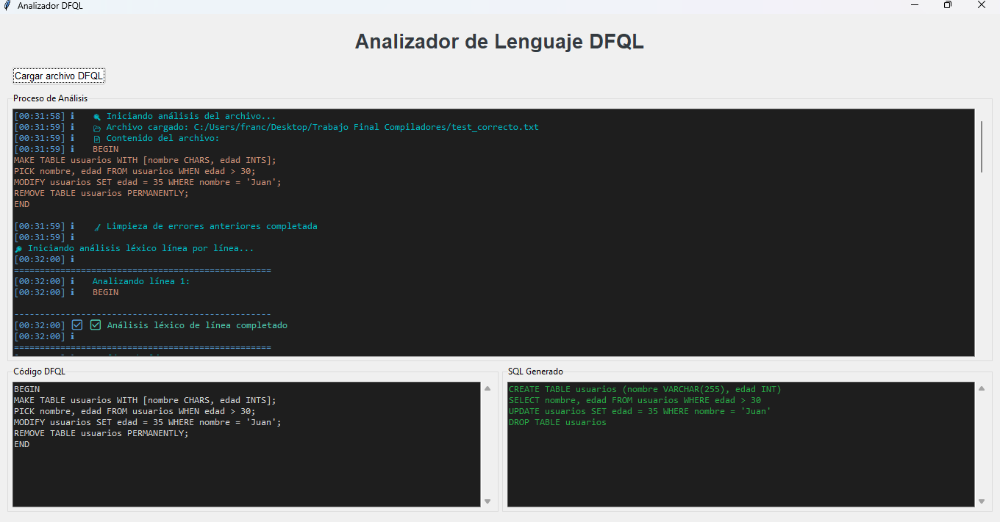

# Compilador SQL

Este proyecto es un compilador básico diseñado para procesar y analizar sentencias SQL utilizando herramientas de análisis léxico y sintáctico en Python. El compilador incluye varias funcionalidades que permiten la interpretación y validación de las sentencias SQL.

## 📚 Descripción

El compilador está compuesto por tres módulos principales:
- **Lex.py**: Realiza el análisis léxico, transformando el código fuente en una secuencia de tokens.
- **SQL.py**: Contiene la lógica principal para el procesamiento y ejecución de las sentencias SQL.
- **Yacc.py**: Maneja el análisis sintáctico de las sentencias SQL, utilizando la gramática definida para asegurar que el código sea válido.

Este compilador se utiliza principalmente para evaluar y probar la corrección de las sentencias SQL. Puede identificar errores léxicos, sintácticos e incluso errores mixtos (combinación de ambos).

## 🛠 Tecnologías utilizadas

- Python 3.x
- PLY (Python Lex-Yacc): Una librería para análisis léxico y sintáctico.

## 🔧 Instalación

1. Clona el repositorio:
   ```bash
   git clone https://github.com/FJMoisesRomero/Compilador-SQL.git
   ```
2. Navega al directorio del proyecto:

   ```bash
   cd Compilador-SQL
3. Instala las dependencias necesarias:
   ```bash
    pip install ply
   
## 🚀 Uso
Para ejecutar el compilador, simplemente corre el archivo main.py desde la terminal:

   ```bash
      python main.py
   ```
El compilador procesará el archivo de entrada y mostrará los resultados. Puedes usar los archivos de prueba incluidos en el proyecto para probar diferentes escenarios de sentencias SQL, como:

test_correcto.txt: Contiene sentencias SQL correctas.
test_error_lexico.txt: Contiene errores léxicos.
test_error_sintactico.txt: Contiene errores sintácticos.
test_error_mixto.txt: Contiene errores mixtos.

## 📊 Archivos de prueba
El proyecto incluye los siguientes archivos de prueba:

test_correcto.txt: Sentencias SQL válidas.
test_error_lexico.txt: Errores léxicos en las sentencias SQL.
test_error_sintactico.txt: Errores sintácticos.
test_error_mixto.txt: Errores combinados de léxico y sintaxis.

## 📸 Capturas del proyecto


## 🧑‍💻 Colaboración
Si deseas contribuir o mejorar el compilador, puedes hacer un fork del repositorio y crear un pull request. Asegúrate de que tu código esté bien documentado y que todos los tests pasen antes de enviar tus cambios.

## 💬 Conectemos
Si tienes alguna pregunta o deseas colaborar, no dudes en contactarme.
